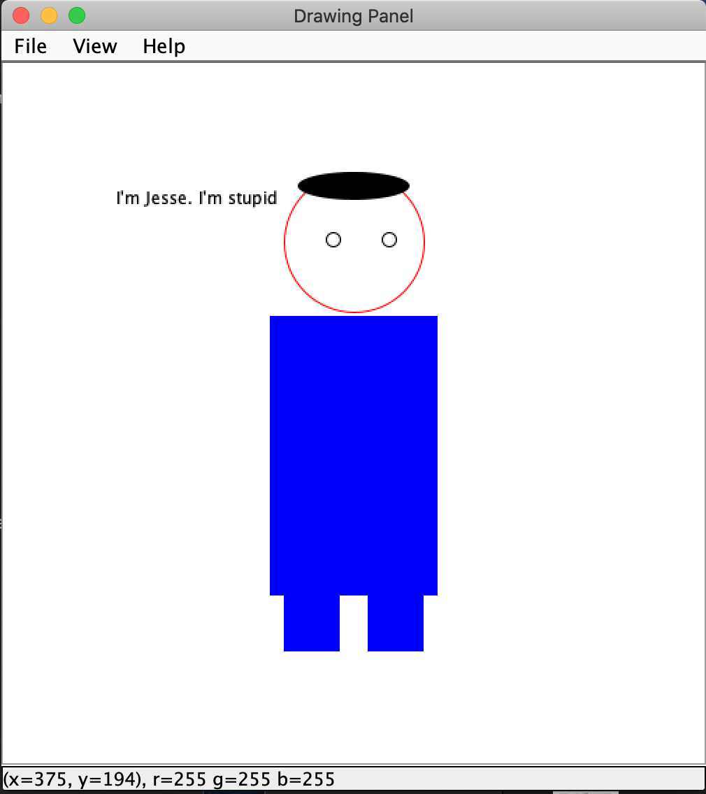

# drawing-panel



```
public final class DrawingPanel
extends Object
implements ImageObserver
```

DrawingPanel is a simplified Java drawing window class to accompany Building Java Programs textbook and associated materials.
Authors: Marty Stepp (Stanford University) and Stuart Reges (University of Washington).

Version: 4.04, 2016/08/17 (to accompany BJP 4th edition).

You can always download the latest DrawingPanel from http://www.buildingjavaprograms.com/drawingpanel/DrawingPanel.java .

For more information and related materials, please visit www.buildingjavaprograms.com .

# COMPATIBILITY NOTE: 
This version of DrawingPanel requires Java 8 or higher. To make this file work on Java 7 and lower, you must make two small modifications to its source code. Search for the two occurrences of the annotation @FunctionalInterface and comment them out or remove those lines. Then the file should compile and run properly on older versions of Java.

# Description:
The DrawingPanel class provides a simple interface for drawing persistent images using a Graphics object. An internal BufferedImage object is used to keep track of what has been drawn. A client of the class simply constructs a DrawingPanel of a particular size and then draws on it with the Graphics object, setting the background color if they so choose.

The intention is that this custom library will mostly "stay out of the way" so that the client mostly interacts with a standard Java java.awt.Graphics object, and therefore most of the experience gained while using this library will transfer to Java graphics programming in other contexts. DrawingPanel is not intended to be a full rich graphical library for things like object-oriented drawing of shapes, animations, creating games, etc.

# Example basic usage:
Here is a canonical example of creating a DrawingPanel of a given size and using it to draw a few shapes.

```
 // basic usage example
 DrawingPanel panel = new DrawingPanel(600, 400);
 Graphics g = panel.getGraphics();
 g.setColor(Color.RED);
 g.fillRect(17, 45, 139, 241);
 g.drawOval(234, 77, 100, 100);
 ...
 ```
 
To ensure that the image is always displayed, a timer calls repaint at regular intervals.